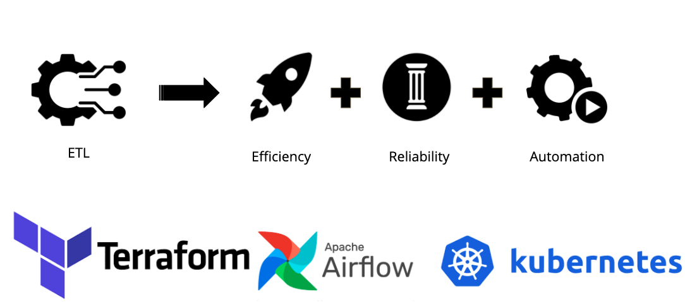
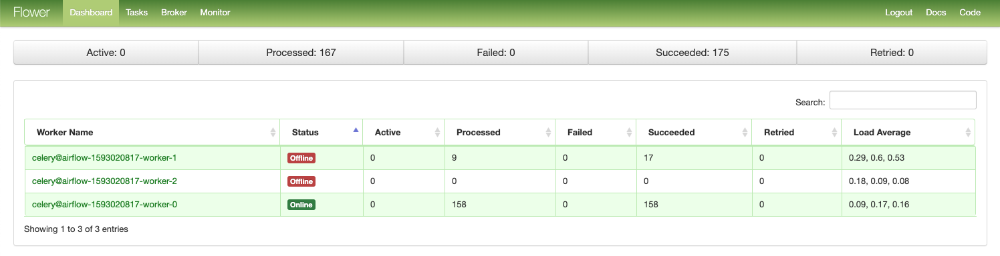

# Air8s 
Build a platform that allows ETL pipline deployed scaled automatically. <br/>
ETL pipeline is managed by airflow running on Amazon Elastic Kubernetes Service. <br/>
Developed at Insight data science, you can see the project demo [here](https://www.youtube.com/watch?v=s9siLuykkq0)


## Architecture
.jpeg)

## Monitoring
### Kubernetes
There are many ways to access the kuberenetes:
- Metrics DashBoard (recommended for online access) 


- k9s (recommended when access locally) 

k9s allows you to observe what is happening inside kubernetes pods, and allow you to interact with pods directly, 
through shell or log.
- command line (basic)

### Airflow
Airflow provides very powerful monitoring tools: Airflow Web and Flower
- Airflow Web


Airflow allows you to manage/monitor/log all ETL workflows.
- Flower


Flower allows you to monitor all work nodes and tasks executed by them.
## Automation Feature
Our platform is implemented at high automation level, including 2 features: <br/> 
1. Automatically deployment of ETL workflows (Airflow dags)
2. Auto-scaling cluster for Airflow <br/>
### Automatically deployment of ETL workflows
The first feature is implemented via git-sync. A git-sync works as a "side-car" image to synchronize 
airflow dagas with a Github repository every 60s. In this project, 
the URL of this repository is https://github.com/GGtray/ETL-dags.git.

### Auto-scale
The Auto-scale cluster is implemented via Kubernetes horizontal pod auto-scaler, it fits the way airflow 
scheduler works.

## Install (on MacOS)
### Requirements
- An AWS account (with enough money in it, eks costs, add IAM role premisson via configuring policy)
- AWS CLI, configure with your AWS account
```
$ aws configure
AWS Access Key ID [None]: YOUR_AWS_ACCESS_KEY_ID
AWS Secret Access Key [None]: YOUR_AWS_SECRET_ACCESS_KEY
Default region name [None]: YOUR_AWS_REGION
Default output format [None]: json
```
this step makes you login your aws account on your computer, thus charge you after your cluster spinned up.
- (Optional) kubectl
- (Optional) wget
### Spin up Kubernetes with one click
```
$ terraform init
$ terraform apply
```
Your cluster shall be up in 30 mins, wait with patience. <br/>

(Optional) Configure kubectl to connect your laptop with cluster
```
$ aws eks --region us-east-2 update-kubeconfig --name [name in the output]
$ terraform apply
```
### Run airflow with one click
```
$ cd charts/stable/airflow
$ helm install stable/airflow -f values.yaml --generate-name
```